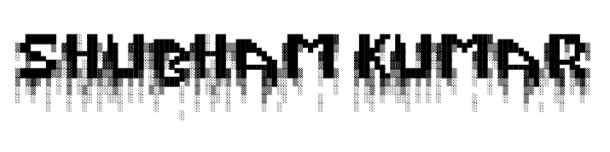

<p>hello there! </p>



<p align="left">
  <span style="margin-right: 8px;">
    <a href="https://shubhamm.me/" target="_blank">
      
    </a>
  </span>
  
  <span style="margin-right: 8px;">
    <a href="https://github.com/shubham-kumr" target="_blank">
      
    </a>
  </span>

  <span style="margin-right: 8px;">
    <a href="https://twitter.com/shubhamkumr_" target="_blank">
      
    </a>
  </span>

  <span style="margin-right: 8px;">
    <a href="https://www.linkedin.com/in/shubham-kumr/" target="_blank">
      
    </a>
  </span>

  <span style="margin-right: 8px;">
    <a href="mailto:forshubhamkumar@gmail.com" target="_blank">
      
    </a>
  </span>

  <span style="margin-right: 8px;">
    <a href="https://leetcode.com/shubham-kumr/" target="_blank">
      
    </a>
  </span>
</p>


```Javascript
class AboutMe {
  constructor() {
    this.name = "Shubham Kumar";
    this.age = 20;
    this.location = "📍 India";
    this.darkMode = true;
    
    this.roles = [
      "Full-Stack Developer",
      "Tech Explorer",
      "Side Project Builder",
      "Lifelong Learner"
    ];

    this.status = {
      learning: ["Cybersecurity", "Blockchain"],
      workingOn: [
        "[Blockchain], [AI Agent]",
        "[OpenSource Contribution]"
      ]
    };

    this.skills = {
      languages: [
        "C", "C++", "Java", "Python", "JavaScript", "HTML", "CSS"
      ],
      frameworks: [
        "React", "Node.js", "Tailwind CSS", "Next.js", "Express.js", "Vue.js"
      ],
      tools: [
        "Postman", "Linux", "Docker", "Git", "VS Code", "Nginx", "Webpack", "Firebase"
      ]
    };
  }
}

const shubham = new AboutMe();

```

[](https://github.com/ryo-ma/github-profile-trophy)

<p align="left">
  
  
</p>
